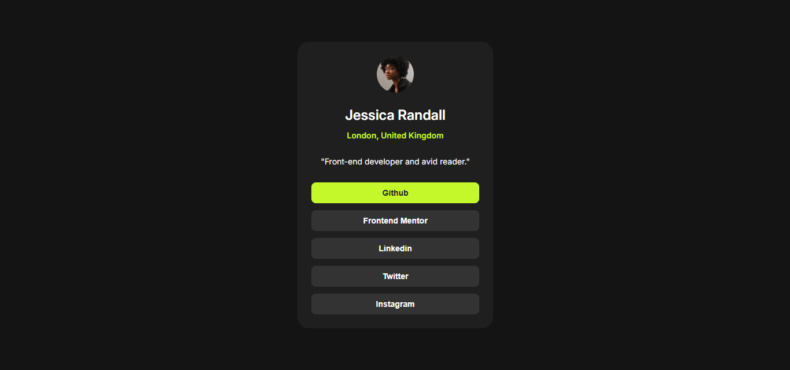

# Frontend Mentor - Social links profile solution

This is a solution to the [Social links profile challenge on Frontend Mentor](https://www.frontendmentor.io/challenges/social-links-profile-UG32l9m6dQ). Frontend Mentor challenges help you improve your coding skills by building realistic projects. 

## Table of contents

- [Overview](#overview)
  - [The challenge](#the-challenge)
  - [Screenshot](#screenshot)
  - [Links](#links)
- [My process](#my-process)
  - [Built with](#built-with)
  - [What I learned](#what-i-learned)
  - [Continued development](#continued-development)
  - [Useful resources](#useful-resources)
- [Author](#author)
- [Acknowledgments](#acknowledgments)

## Overview

### The challenge

Users should be able to:

- See hover and active states for all interactive elements on the page

### Screenshot



### Links

- Solution URL: [https://github.com/mdismail13/Social-links-profile.git](https://github.com/mdismail13/Social-links-profile.git)
- Live Site URL: [https://mdismail13.github.io/Social-links-profile/](https://mdismail13.github.io/Social-links-profile/)

## My process

### Built with

- Semantic HTML5 markup
- CSS custom properties
- Flexbox
- CSS Grid
- Mobile-first workflow
- Google Fonts (Inter)

### What I learned

While working on this project, I learned how to:

- Center a card perfectly using CSS Grid (`place-items: center`)
- Use `:root` to manage color variables for easy theme customization
- Add transitions and `:hover`, `:active` effects smoothly
- Build reusable, clean button styles using shared classes

Here’s a simple code I liked:

```css
.card-btn:hover {
  background-color: var(--Green);
  color: var(--Grey-800);
  cursor: pointer;
}
```

### Continued development

In future projects, I want to focus on:

- Making my components more accessible with semantic HTML and `aria` attributes  
- Adding real links to each social media button (currently they are just buttons)  
- Adding a dark/light mode toggle using JavaScript and CSS variables  
- Making the design more dynamic using JavaScript (like profile data coming from JSON)  
- Improving responsiveness on very small screens (less than 320px)

### Useful resources

- [MDN Web Docs - CSS Grid Layout](https://developer.mozilla.org/en-US/docs/Web/CSS/CSS_grid_layout) - Helped me understand how to center content using grid and manage layout effectively.
- [Google Fonts - Inter](https://fonts.google.com/specimen/Inter) - Used to apply clean and modern typography to the design.
- [Frontend Mentor](https://www.frontendmentor.io/) - Source of this great challenge, also a great place to learn by doing real-world projects.
- [CSS Tricks - Flexbox Guide](https://css-tricks.com/snippets/css/a-guide-to-flexbox/) - Very helpful for aligning and spacing elements inside the card.

## Author

- Name - Md. Ismail  
- Frontend Mentor - [@mdismail13](https://www.frontendmentor.io/profile/mdismail13)  
- GitHub - [mdismail13](https://github.com/mdismail13)
- Facebook - [Ismail H. Emon](https://www.facebook.com/ismail.h.emon/)

## Acknowledgments

I would like to thank Frontend Mentor for providing this awesome challenge that helped me improve my HTML and CSS skills.  

Also, thanks to the online developer community for the valuable resources and support throughout the project.  

Special shout out to all the tutorials and documentation from MDN Web Docs and CSS Tricks that guided me along the way.
